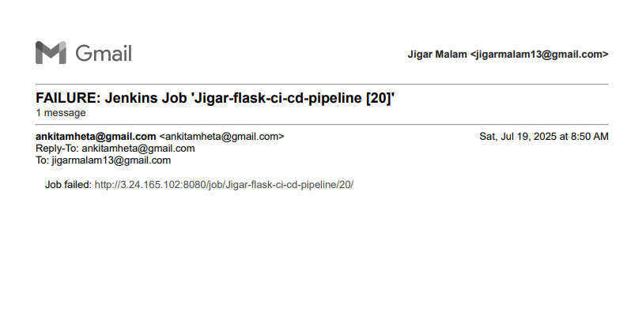

# 🧪 Jenkins CI/CD Pipeline for Flask App

This project demonstrates a simple Continuous Integration and Continuous Deployment (CI/CD) pipeline for a Python Flask web application using **Jenkins**. The pipeline automates the following steps:

- Build the virtual environment & install dependencies
- Run unit tests using `pytest`
- Deploy (Placeholder step)
- Send email notifications on **success/failure**

---

## 🧰 Tools & Technologies Used

- 🐍 Python
- 🌐 Flask
- ✅ Pytest
- 🐳 Jenkins (CI/CD)
- 📧 Email Notification Plugin (SMTP Configuration)

## Steps to Run

1. Clone this repo to your Jenkins server.
2. Create a new Jenkins Pipeline project.
3. Configure your SMTP Mail Settings under Manage Jenkins > Configure System.
4. Paste the above Jenkinsfile into your project.
5. Run the pipeline and monitor the output.
6. Check email for build notifications.

## Pipeline Flow Diagram

## Screenshot

| Description                        | Screenshot                          |
|-------------------------------------|-------------------------------------|
| Jenkins Job Console Output - Failed |     |
| Failure-Mail                       |       |
| Success-Mail                       |       |
| Jenkins Job Console Output - Success|    |

  

